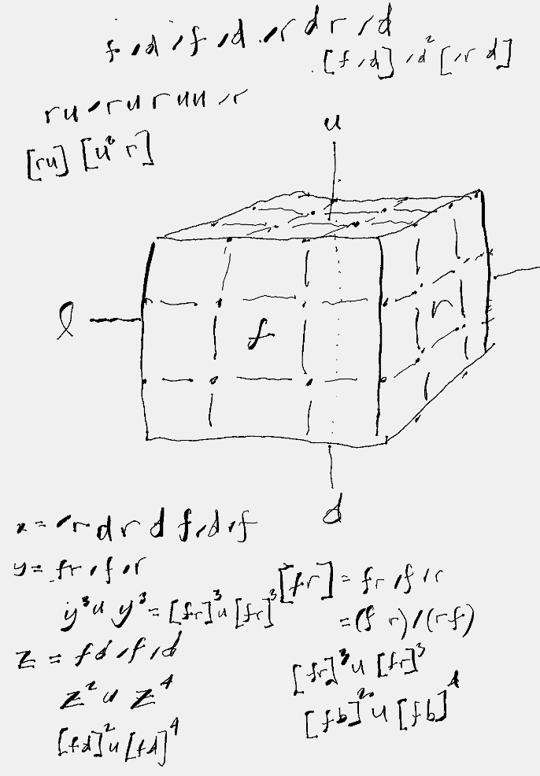

rustcube
========

This includes a polished Go implementation, and a much simpler Rust implementation.


The language has support for basic group theory.
Most moves are made of nested commutators,
and conjugates.  ie:

- f/f = (fr)/(fr) = \[fr\]/\[fr\] = {fr}/{fr} = ()
- /\[fr\] = \[rf\]
- /{fr} = {rf}
- /(fr) = /r /f
- (rf)2 = (rf)(rf)
- {rf}2 = {rf}{rf}
- \[rf\]\[rf\] = \[rf\]\[rf\]
- \[fr\] = f r /f r -- commutator, which measures commutativity
- {fr} = f r /f r -- conjugate, which nests r inside of f
- Example: {f \[ru\]} = f r u /r /u /f
- Example: \[\[fr\]3 u\] = f r /f /r  f r /f /r  f r /f /r  u  r f /r /f  r f /r /f  r f /r /f  /u
- Example: \[\[fd\]3 u\]




A command-line tool for Rubiks Cube calculations.
We want to draw the state of a rubiks cube like this:

```
  ... bbb ...
 
.     uuu     .
.     uuu     .
.     uuu     .

b lll fff rrr b
b lll fff rrr b
b lll fff rrr b

.     ddd     .
.     ddd     .
.     ddd     .

  ... bbb ...
```

We need to be able to lookup the sticker color
for 1d centers, 2d edges, and 3d corners.
ie, where all corners are clockwise-winding:

  - u: u
  - ur: r
  - rf: r
  - fur: f

All faces enumerate adjacencies as counter-clockwise-winding:

  - f: u l d r
  - u: b l f r

The main thing is that upper-case to move the whole cube by its face,
or use lower case to turn a face, and use "/" to negate a turn.
When you type in a move like "r u /r /u", you can figure out its period,
by pressing return until the cube is solved again. The repeats will
tell you that "r u /r /u" has period 6.

You can use the CLI to solve a cube after you scramble it.


Examples. Before execution, things are flattened out.
Numbers and parenthesis are not yet implemented

- "r u" => "ru"
- "(r u)" => "ru"
- "r u /r /u" => "ru/r/u"

Used in rlwrap, you can repeat tedious commands. Not yet implemented, but might be a good idea:

- "u2" => "uu"
- "u12" => "uuuuuuuuuuuu"
- "/(ur)" => "/r/u" negation in parens
- "(r u)/(u r)" => "ru/r/u"
- "((r u)/(u r))3" => "ru/r/uru/r/uru/r/u"
- "[r u]" => "r u /r /u" commutator
- "x = [r u]3" => "ru/r/u ru/r/u ru/r/u" set to a value "x" for reuse
- "[r u][(u2) r]" => "ru /r/u uu r /u/u r" = "ru/r u r/u/u" note that more than faces have patterns 
- "[fd]2u[fd]4" => "fd/d/f fd/d/f uu fd/f/d fd/f/d fd/f/d fd/f/d" overalperiod 6 for "[fd]"
> Should the period be calculated immediately for every command? Currently, we just counted how many times we did something.

We should have named moves, and allow moves to be reflected across an axis.
As you solve, you should save complicated moves; and be able to re-use them.
You may want to do entire sections of a solve with a command.
Perhaps you can do an entire solve as one command if you can see far ahead enough.
